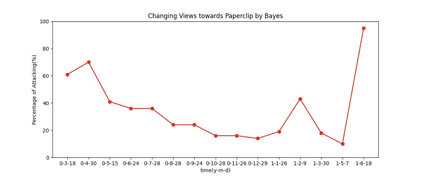

# bilibili-papercilp-viewlearning

使用Bilibili网站对于"回形针Paperclip"视频的评论，利用贝叶斯理论构建朴素贝叶斯模型，并利用模型研究近期(2021年6月)网民对于"回形针Paperclip"的情感态度变化。

**作业报告：[report.pdf](./report.pdf)**

## 简介

关于数据：

爬取了约1500条评论，手动标注了约1000条评论：1对应消极 / 0对应积极(training_set.csv)，作为训练集和测试集，另外一部分作为最终分析情感变化的预测集合(comment_predict.csv)。

在朴素贝叶斯模型上做了以下优化：

* 拉普拉斯修正

  没有完全遵循原有公式，而是进行了略微修改。

* 拟合正态分布模型

  由于评论长度可能也是影响情感态度的一个维度，故使用最大似然估计法，将评论的长度视为正态分布，也作为确定评论情感态度的因子。

关于结果：

时间线：

* 20-04-30：肉蛋奶事件
* 21-02-09："赛雷话金"第一次锤
* 21-06-18："赛雷话金"第二次锤&美国军方背景

可见结果的正确性不错。

## 文件功能

* bayes.py 

  核心文件

* spider.py

  BiliBili视频评论爬虫

* dict.txt

  引入词典，避免对于一些特殊词汇无法正常分词。

* stopwords.txt

  停止词，过滤无意义的词汇。

* training_set.csv

  训练集&测试集

* comment_predict.csv

  结果预测集合
